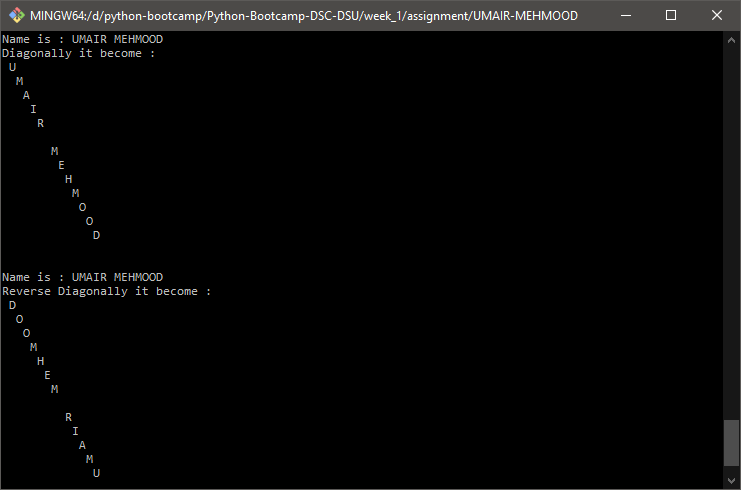
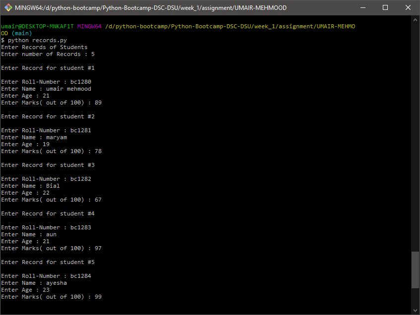
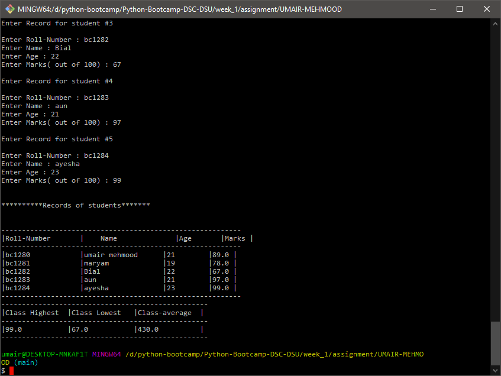
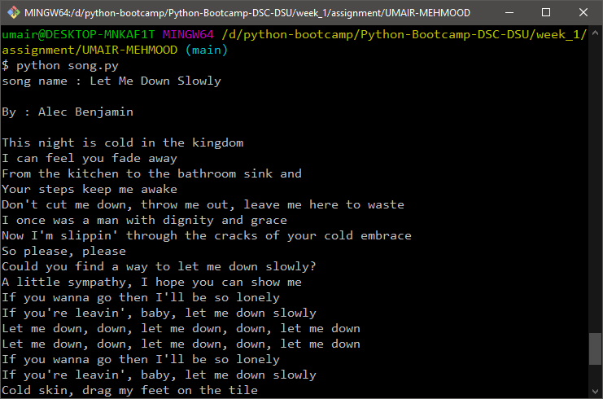

# My name is Umair Mehmood

here is my assignment solution for Python Bootcamp

## Task 1

in task one the prblem was to display name diagonally
so here is my solution for this.

<mark style="color:red; background-color:transparent;">**Solution**</mark>

```python
space = 0
#function to print diagonally
def to_diagonally(name):
    global space
    for letter in name:
        print(f"{' '*space} {letter}")
        space+=1
    else: space = 0

#main function 
def main():
    #Diagonal name printi
    name = "UMAIR MEHMOOD"

    print(f"Name is : {name}")
    print("Diagonally it become :")
    to_diagonally(name)

    #diagonal name print in reverse

    print(f"\n\nName is : {name}")
    print("Reverse Diagonally it become :")
    to_diagonally(name[::-1])

if __name__== "__main__":
    main()
```

### Explaination

when script runs ``main()`` function called. In ``main()`` i have stored my name in variable ``name`` and then i called a function ``to_diagonally()`` it will take name as paramiter and
then I have added a ``loop`` that print spaces and letter on each line by default ``space`` is set to ``0`` so on rach iteration value of ``space`` will be increases and spaces will be printed before letter and creates a diagonal shape.

to Display reverse Diagonally I have called ``to_diagonally()``  again by passing ``name`` as ``name[::-1]`` it will first reverse string and then it will be displayed as diagonally but this time it will be reversed.

``else: space = 0`` it will reset ``space`` value to ``0`` after loops completed. as I am using ``global space`` so we need to reset it before we use it again.

<br>``Output``

<p align="center"></img></p>

## Task 2

Problem was to write a script that get records of students from user and and display it in tabular form and display Highest , Lowest , Avarage scores.

<mark style="color:red; background-color:transparent;">**Solution**</mark>

```python
def getStudentRecord(numberOfRecords,studentlist):
    n=1
    while(numberOfRecords>0):
        student={}
        print(f"\nEnter Record for student #{n}\n")
        rollNumber = input("Enter Roll-Number : ")
        name = input("Enter Name : ")
        age = int(input("Enter Age : "))
        while True:
            marks = float(input("Enter Marks( out of 100) : "))
            if marks >= 0.0 and marks <= 100.0:
                break 
        student["rollNumber"] = rollNumber
        student["name"] = name
        student["age"] = age
        student["marks"] = marks
        studentlist.append(student)
        numberOfRecords-=1
        n+=1

#returns lowest , highest , avarage scores
def getHLA(studentlist):
    marks_sum=0
    max_score =0
    min_score =studentlist[0]['marks']
    for x in studentlist:
        if x['marks'] > max_score: max_score = x['marks']
        if x['marks'] < min_score: min_score = x['marks']
        marks_sum+= x['marks']
    avg=marks_sum/len(studentlist)
    return max_score,min_score,marks_sum

def main():

    studentlist= list()
    
    print("Enter Records of Students")
    
    numberOfRecords = int(input("Enter number of Records : "))
    getStudentRecord(numberOfRecords,studentlist)
    
    max_score,min_score,class_avg=getHLA(studentlist)

    print(f"\n\n**********Records of students*******\n\n")
    print(f"{'-'*58}")
    print(f"|Roll-Number{' '*(18-len('Roll-Number'))}|\
    Name{' '*(18-len('name'))}|Age{' '*(10-len('age'))}|Marks |")
    print(f"{'-'*58}")
    for x in studentlist:
        print(
            f"|{x['rollNumber']}{' '*(18-len(x['rollNumber']))}|"\
            f"{x['name']}{' '*(19-len(x['name']))}|"\
            f"{x['age']}{' '*(11-len('age'))}|"\
            f"{x['marks']} |"
            )
    print(f"{'-'*58}")

    print(f"{'-'*50}")
    print(f"|Class Highest{' '*(15-len('class-highest'))}|"\
            f"Class Lowest{' '*(15-len('class-lowest'))}|Class-average{' '*(15-len('class-avarage'))}|")
    print(f"{'-'*50}")
    print(f"|{max_score}{' '*(24-len('class-highest'))}|"\
            f"{min_score}{' '*(23-len('class-lowest'))}|{float('{:.2f}'.format(class_avg))}{' '*(23-len('class-avarage'))}|")

    print(f"{'-'*50}")


if __name__== "__main__":
    main()
```

### Explaination for above program

on runing script ``main()`` function will be called and in main function I have created a empty list ``studentlist`` and then program will ask from user that how many records will be added and that input will be stored in ``numberOfRecords`` varialbe and then ``getStudentRecords()`` will be called with paramiters ``numberOfRecords`` and ``studentlist``.

In ``getStudentRecords()`` I have set ``n=1`` that is just for show number if record that is going to enter from ``n to numberOfRecords``. then a while loops starts until ``numberOfRecords > 0`` and on each time its will be reduced and value of ``n`` will incremented.
In loop I have created a empty `Dictionary` named `student` and will ask from user enter student roll number , name , age ,marks and then store these details in `student` Dictionary.

there is another ``while`` loop . in this loop it will ask from user to enter marks and test if the marks are in range of ``0 to 100`` if in the range then loop will ``break`` and if not in range then it will keeps asking until user did not enter ``marks`` in range.

on each record enter by user will be added on ``student`` dictionary and then whole dictionary will be appendted into ``studentlist`` which is a list created in ``main()`` and bassed to ``getStudentRecords()``.

after adding all the records in `studentlist` now we will get
class highest ,lowest , avarage score from ``studentlist``.
for this I have created a function `getHLA()` that will take one paramiter which is ``studentlist`` list of student records.

in that function i have declared and initialize variables.
``marks_sum=0`` will store the sum of all the marks in the recrod
``max_score=0`` will take highest score from the record
``min_score=studentlist[0]['marks']`` will store marks of the first student in list.

then i have loop in each itiration if the
``x['marks'] > max_score``  then ``max_score = x['marks']``
and if ``x['marks'] < min_score``  then ``min_score = x['marks']`` and sum of all the marks will be calculated at this line ``marks_sum+= x['marks']``.
and then avarage will be calculated as ``avg=marks_sum/len(studentlist)`` where ``len(studentlist)`` will return number of records that are in studentlist and sum of marks will be divided by ``lenght of list`` and stored in ``avg``. and then valued returned as tuple  ``return max_score,min_score,marks_sum`` and will be unpacked at this line
``max_score,min_score,class_avg=getHLA(studentlist)``.

after getting records and geting highest and lowest and avarage will display result on console in tabuler form.

here `print(f{'-'*10})` will just display ``-`` 10 times.
and all the ither stuf like ``' '*(10-len('name'))`` will just add some extra space too make it more `readable` in ``tabular`` form.

<br>``Output``

<p align="center"></img></p>
<p align="center"></img></p>

## Task 3
problem 3 was to display lyrics of a song by delaying each line with 1 second.

<mark style="color:red; background-color:transparent;">**Solution**</mark>

```python
import time


def playSong(song):
    for line in song:
        print(line)
        time.sleep(1)


song = f"""This night is cold in the kingdom
I can feel you fade away
From the kitchen to the bathroom sink and
Your steps keep me awake
Don't cut me down, throw me out, leave me here to waste
I once was a man with dignity and grace
Now I'm slippin' through the cracks of your cold embrace
So please, please
Could you find a way to let me down slowly?
A little sympathy, I hope you can show me
If you wanna go then I'll be so lonely
If you're leavin', baby, let me down slowly
Let me down, down, let me down, down, let me down
Let me down, down, let me down, down, let me down
If you wanna go then I'll be so lonely
If you're leavin', baby, let me down slowly
Cold skin, drag my feet on the tile
As I'm walking down the corridor
And I know we haven't talked in a while
So I'm looking for an open door
Don't cut me down, throw me out, leave me here to waste
I once was a man with dignity and grace
Now I'm slippin' through the cracks of your cold embrace
So please, please
Could you find a way to let me down slowly?
A little sympathy, I hope you can show me
If you wanna go then I'll be so lonely
If you're leavin', baby, let me down slowly
Let me down, down, let me down, down, let me down
Let me down, down, let me down, down, let me down
If you wanna go then I'll be so lonely
If you're leavin', baby, let me down slowly
And I can't stop myself from fallin' (down) down
And I can't stop myself from fallin' (down) down
And I can't stop myself from fallin' (down) down
And I can't stop myself from fallin' (down) down
Could you find a way to let me down slowly?
A little sympathy, I hope you can show me
If you wanna go then I'll be so lonely
If you're leavin', baby, let me down slowly
Let me down, down, let me down, down, let me down
Let me down, down, let me down, down, let me down
If you wanna go then I'll be so lonely
If you're leavin', baby, let me down slowly
If you wanna go then I'll be so lonely
If you're leavin', baby, let me down slowly"""

song = song.split('\n')
time.sleep(1)
print("song name : Let Me Down Slowly\n")
time.sleep(1)
print("By : Alec Benjamin\n")
time.sleep(1)
playSong(song)
```

### Explaination for task 3

on the first lime I have ``import time`` it is important to import because in time module there is function ``sleep()`` that i have to use to delay execution of program by 1 sec.
then I have function ``playSong()`` that will take my song do the following task.
before calling ``playSong()`` in song variable I have a stored text of the song that I get from google after that I convert it into a ``list`` by using ``split()`` by passing ``'\n'`` as I want to split lines where i have new line so it will return list of lines.
then I have displayed song name , song artist
and then I have called ``playSong()``  in it run a loop on ``song`` because now its a list if string and on each iteration i have used ``sleep(1)`` to delay each output 1 sec and line will be printed.

output:
<p align="center"></img></p>
